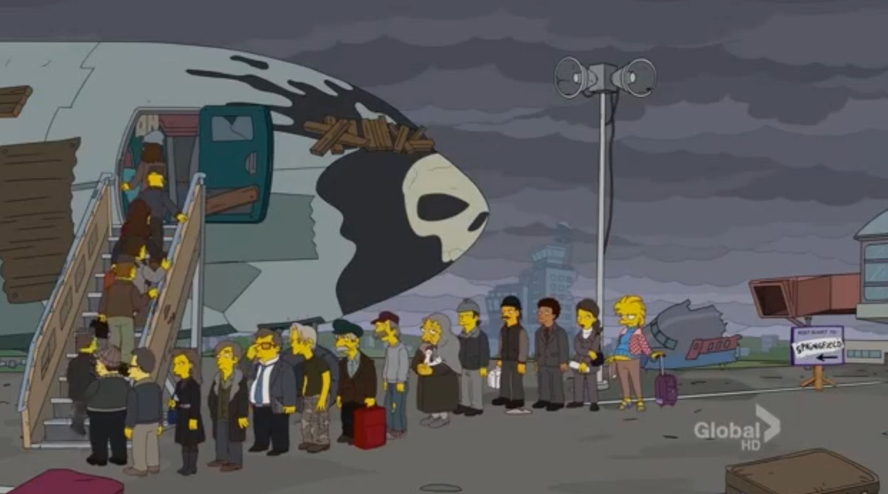

 
Are flight tickets really the cheapest on Tuesday mornings? 

## Idea
The project started as a bet among my friends when I told my observation about booking flights that they are the cheapest on Tuesday (office-time) mornings. So here I'll try to hypothesize my postulate by collecting data from multiple flight booking services for multiple future flights(holiday & non-holiday both) and analysing it graphically.

> "Oh, ma'am, you really shouldn't teleport when you're pregnant. I'm afraid your only choice is (*whispers*): AIR TRAVEL." 
 
@The Simpsons: Holidays Of Future Passed

## Plan
* Scrape data from multiple booking sites.
* Plot using D3 the following:
    * for day Di(i:0,N) :  plot price pjk(j:1,b; k:1,f) v/s time th(h:0-24)
         where: 
        * N = number of days I want to make observations
        * b = number of booking sites to take data from
        * f = number of flights I want to observe prices for
        * h = hours of day
    * Pi = avg(pji(j:0,b)) v/s th(h:0-24) for all days Di(i:0,N)
    * Insert other plots here

## Conclusion
TODO: TBD//
 

>  If you are seated in an exit row, please hold the door shut for the duration of the flight.

